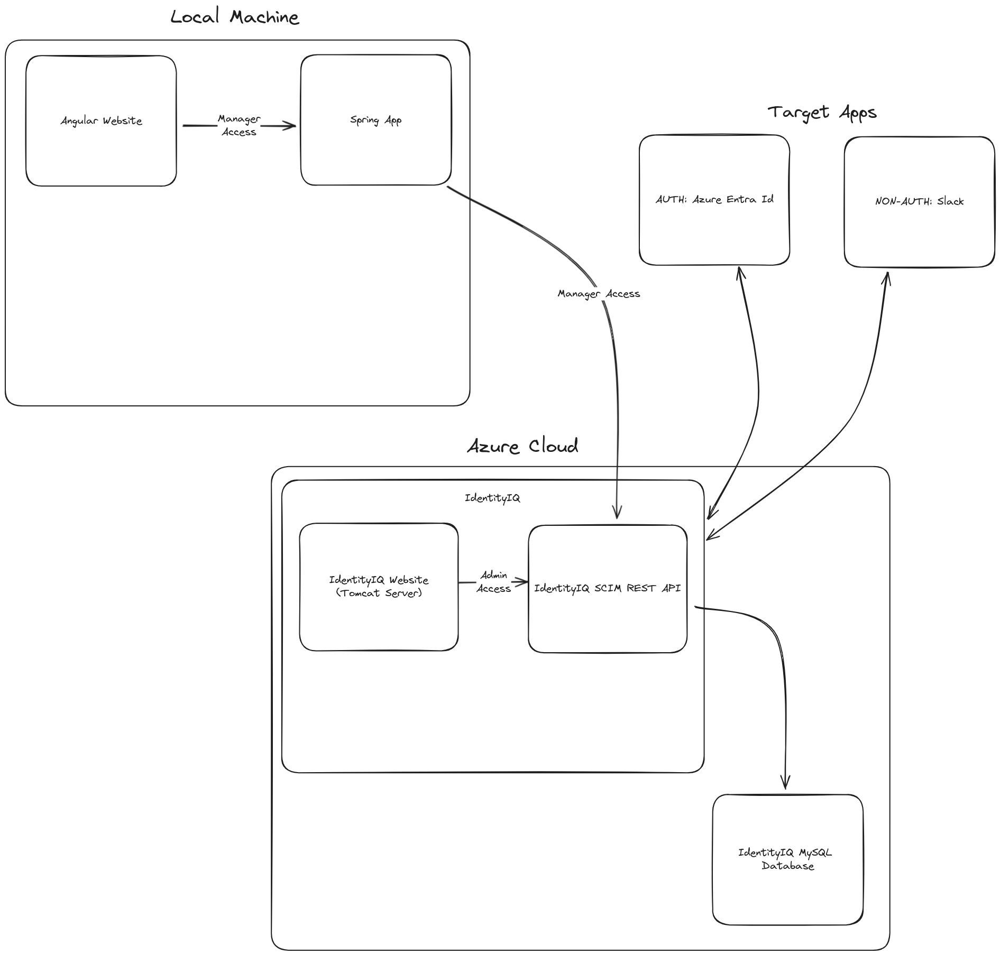

# Charter

Team: Shark Tales
Members: Luis Garcia, Jared Mai, Gabe Guio

## Objective
 - Enable MANAGERS to create and mange users without having to log into sailpoint.
 - Enable ADMINS to access sailpoint to manage roles and entitlements in target applications.

## Use Cases
 1. As a manager, I would like to create new users and assign them to a role (set of entitlements) for a target application.
 2. As a manager, I would get a list of users and their roles from SailPoint.
 3. As a manager, I would like update a user's role or personal information in SailPoint.
 4. As a manager, I would like to delete a users and remove them from SailPoint.
 5. As a manager, I would like to get a list of users from SailPoint.
 6. MAYBE As a manager, I would like to get a list of users by manager from SailPoint.
 7. As an admin, I would like to manage users in Entra ID from SailPoint
 8. As an admin, I would like to manage permissions/roles/entitlements in Target Application from SailPoint.

## Architecture Diagram

## Deploying Cloud Infrastructure (TODO: Jared Mai)
 - TODO: Link to installation notes
 - TODO: Docker Containers in a VM
 
## Connecting Target Apps (TODO)
 - TODO: Connecting application to Local SailPoint
 - TODO: Summarizing permissions and roles in Slack
 
## Building Local Repo (TODO: Luis Garcia Q)
 - TODO: Build basic angular app and push to repo
 - TODO: Build spring app and push to repo
 
## API Endpoints
 ### 1. POST /user
 
  **Request Body #1: Create User**
  
    {
      "userName": "Mock.User"
    }

  **Request Body #2: Create User and Role**
  
    {
      "userName": "Mock.User"
      "role": "Full members"
    }

  **Request Body #3: Create User with Personal Information**
  
    {
      "userName": "Mock.User",
      "name": {
        "formatted": "Ms. Barbara J Jensen, III",
        "familyName": "Jensen",
        "givenName": "Barbara"
      },
      "displayName": "Barbara Jensen",
      "userType": "employee",
      "active": true,
      "password": "string",
      "emails": [
        {
          "type": "work",
          "value": "Barbara.Jensen@example.com",
          "primary": "true"
        }
      ]
    }

  **Request Body #4: Create User with Personal Information and Role**
  
    {
      "userName": "Mock.User",
      "name": {
        "formatted": "Ms. Barbara J Jensen, III",
        "familyName": "Jensen",
        "givenName": "Barbara"
      },
      "displayName": "Barbara Jensen",
      "userType": "employee",
      "active": true,
      "password": "string",
      "emails": [
        {
          "type": "work",
          "value": "Barbara.Jensen@example.com",
          "primary": "true"
        }
      ]
      "role": "Full members"
    }

  **Response** 
   - 201: Created Succesfully
   - 409: Create Failed

 ### 2. GET /user/{userId}
     
  **Response** 
   - 200: Get Succes
     - Request Body: User Data
   - 404: User not found
    
 ### 3. POST /user/{userId}
 
  **Request Body #1: Update a User with Personal Information and Role**
  
    {
      "userName": "Mock.User",
      "name": {
        "formatted": "Ms. Barbara J Jensen, III",
        "familyName": "Jensen",
        "givenName": "Barbara"
      },
      "displayName": "Barbara Jensen",
      "userType": "employee",
      "active": true,
      "password": "string",
      "emails": [
        {
          "type": "work",
          "value": "Barbara.Jensen@example.com",
          "primary": "true"
  			}
      ]
      "role": "Full members"
    }
    
  **Response**
   - 200: Update Success
   - 404: User Not found
    
 ### 4. DELETE /user/{userId}
    
  **Response**
    - 204: Delete Success

## Entities from Identity IQ (TODO) 
 - TODO: Identify Models in Spring
 - TODO: Complete an ERD

## Front UI Images (TODO)
 - TODO: Documenting components from PrimeNG
 - TODO: Assembling UI documentation
 
 
 
 
 
 
 
